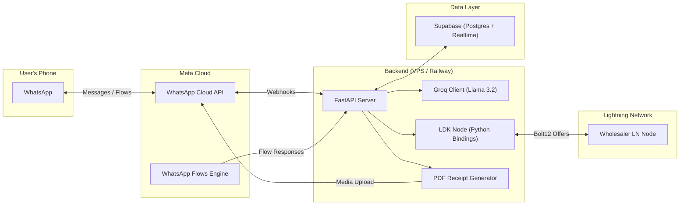

# 🏪 Kiosk-GPT — Implementation Plan

> **WhatsApp-native kiosk management for Kenyan shopkeepers, powered by AI + Lightning**

---

## 1. Architecture Overview



---

## 2. Tech Stack Summary

| Layer | Technology | Version / Notes |
|---|---|---|
| **Frontend** | WhatsApp Cloud API + Flows | v21.0+, JSON spec v7.2+ |
| **Backend** | Python + FastAPI | Python 3.11+, FastAPI 0.115+ |
| **AI Parser** | Llama 3.2 3B via Groq | `llama-3.2-3b-preview` model |
| **Payments** | LDK Node (Python bindings) | Bolt12 Offers support |
| **Database** | Supabase (Postgres) | Realtime enabled |
| **PDF Engine** | ReportLab or WeasyPrint | Receipt generation |
| **Hosting** | Railway / Render / VPS | With ngrok for dev |

---

## 3. ADR-001: Architecture Decision Record

| Decision | Selection | Justification |
|---|---|---|
| Messaging | WhatsApp Service Messages | Free within 24-hour windows in Kenya (2026 rates) |
| Payment Protocol | Bolt12 (Offers) | Static, reusable QR codes for wholesalers — no new invoice per transaction |
| Language Support | Sheng-Fine-Tuning | GSMA 2026 Swahili reasoning model ensures local dialects don't break the parser |
| Database | Supabase | Built-in realtime subscriptions give shopkeepers a free web dashboard |
| AI Inference | Groq (hosted) | Sub-100ms TTFT, free tier for MVP, OpenAI-compatible API |

---

## 4. Project Directory Structure

```
kiosk-GPT/
├── .env.example                 # Template for environment variables
├── .gitignore
├── README.md
├── requirements.txt
├── pyproject.toml
│
├── app/                         # FastAPI application
│   ├── __init__.py
│   ├── main.py                  # App entrypoint, lifespan events
│   ├── config.py                # Settings via pydantic-settings
│   │
│   ├── api/                     # Route handlers
│   │   ├── __init__.py
│   │   ├── webhooks.py          # WhatsApp webhook verification + message handler
│   │   ├── flows.py             # WhatsApp Flows data exchange endpoint
│   │   └── health.py            # Health check endpoint
│   │
│   ├── services/                # Business logic
│   │   ├── __init__.py
│   │   ├── whatsapp.py          # Send messages, templates, media via Cloud API
│   │   ├── ai_parser.py         # Groq/Llama integration — Sheng/Swahili → JSON
│   │   ├── inventory.py         # Stock CRUD, low-stock alerts
│   │   ├── lightning.py         # LDK Node wrapper — Bolt12 payments
│   │   └── receipts.py          # PDF receipt generation
│   │
│   ├── models/                  # Pydantic models & DB schemas
│   │   ├── __init__.py
│   │   ├── duka.py              # Shop/duka model
│   │   ├── inventory.py         # Inventory item model
│   │   ├── transaction.py       # Sale & payment transaction model
│   │   └── webhook.py           # WhatsApp webhook payload models
│   │
│   ├── db/                      # Database layer
│   │   ├── __init__.py
│   │   └── supabase.py          # Supabase client initialization + helpers
│   │
│   └── utils/                   # Shared utilities
│       ├── __init__.py
│       ├── logger.py            # Structured logging
│       └── constants.py         # Shared constants
│
├── whatsapp_flows/              # WhatsApp Flow JSON definitions
│   └── registration_flow.json   # Registration flow (Screen 1)
│
├── prompts/                     # AI prompt templates
│   └── sale_parser.txt          # One-shot Sheng/Swahili → JSON prompt
│
├── tests/                       # Test suite
│   ├── __init__.py
│   ├── test_ai_parser.py
│   ├── test_webhooks.py
│   ├── test_inventory.py
│   └── test_lightning.py
│
├── scripts/                     # Dev & deployment scripts
│   ├── seed_db.py               # Seed Supabase with sample data
│   └── setup_whatsapp.py        # Automate Flow creation via API
│
└── dashboard/                   # (Optional) Simple web dashboard
    ├── index.html
    ├── style.css
    └── app.js                   # Connects to Supabase Realtime
```

---

## 5. Database Schema (Supabase)

```sql
-- ==========================================
-- TABLE: dukas (shops)
-- ==========================================
CREATE TABLE dukas (
    id UUID PRIMARY KEY DEFAULT gen_random_uuid(),
    wa_phone_id TEXT UNIQUE NOT NULL,        -- WhatsApp phone number ID
    phone_number TEXT UNIQUE NOT NULL,        -- E.164 format
    duka_name TEXT NOT NULL,
    inventory_type TEXT NOT NULL CHECK (inventory_type IN ('grocery', 'electronics', 'general')),
    lightning_address TEXT,                    -- For receiving payments
    ldk_node_id TEXT,                          -- LDK Node public key
    created_at TIMESTAMPTZ DEFAULT NOW(),
    updated_at TIMESTAMPTZ DEFAULT NOW()
);

-- ==========================================
-- TABLE: inventory
-- ==========================================
CREATE TABLE inventory (
    id UUID PRIMARY KEY DEFAULT gen_random_uuid(),
    duka_id UUID REFERENCES dukas(id) ON DELETE CASCADE,
    item_name TEXT NOT NULL,
    item_name_local TEXT,                      -- Sheng/Swahili name
    quantity INTEGER NOT NULL DEFAULT 0,
    unit_price_kes NUMERIC(10,2) NOT NULL,     -- Price in KES
    unit_price_sats BIGINT,                    -- Price in Sats
    reorder_threshold INTEGER DEFAULT 10,
    wholesaler_bolt12_offer TEXT,              -- Wholesaler's Bolt12 offer string
    created_at TIMESTAMPTZ DEFAULT NOW(),
    updated_at TIMESTAMPTZ DEFAULT NOW(),
    UNIQUE(duka_id, item_name)
);

-- ==========================================
-- TABLE: sales
-- ==========================================
CREATE TABLE sales (
    id UUID PRIMARY KEY DEFAULT gen_random_uuid(),
    duka_id UUID REFERENCES dukas(id) ON DELETE CASCADE,
    raw_message TEXT NOT NULL,                 -- Original Sheng/Swahili text
    parsed_items JSONB NOT NULL,              -- AI-parsed items array
    total_kes NUMERIC(10,2),
    total_sats BIGINT,
    created_at TIMESTAMPTZ DEFAULT NOW()
);

-- ==========================================
-- TABLE: payments (Lightning transactions)
-- ==========================================
CREATE TABLE payments (
    id UUID PRIMARY KEY DEFAULT gen_random_uuid(),
    duka_id UUID REFERENCES dukas(id) ON DELETE CASCADE,
    sale_id UUID REFERENCES sales(id),
    payment_type TEXT NOT NULL CHECK (payment_type IN ('reorder', 'customer_payment', 'withdrawal')),
    amount_sats BIGINT NOT NULL,
    bolt12_offer TEXT,
    payment_hash TEXT,
    payment_preimage TEXT,
    status TEXT NOT NULL DEFAULT 'pending' CHECK (status IN ('pending', 'completed', 'failed')),
    receipt_url TEXT,                          -- URL to PDF receipt
    created_at TIMESTAMPTZ DEFAULT NOW()
);

-- Enable Realtime on all tables
ALTER PUBLICATION supabase_realtime ADD TABLE dukas;
ALTER PUBLICATION supabase_realtime ADD TABLE inventory;
ALTER PUBLICATION supabase_realtime ADD TABLE sales;
ALTER PUBLICATION supabase_realtime ADD TABLE payments;

-- Row Level Security
ALTER TABLE dukas ENABLE ROW LEVEL SECURITY;
ALTER TABLE inventory ENABLE ROW LEVEL SECURITY;
ALTER TABLE sales ENABLE ROW LEVEL SECURITY;
ALTER TABLE payments ENABLE ROW LEVEL SECURITY;
```

---

## 6. Environment Variables

```env
# === WhatsApp Cloud API ===
WHATSAPP_TOKEN=your_permanent_token
WHATSAPP_PHONE_NUMBER_ID=your_phone_number_id
WHATSAPP_BUSINESS_ACCOUNT_ID=your_waba_id
WHATSAPP_VERIFY_TOKEN=your_custom_verify_token
WHATSAPP_APP_SECRET=your_app_secret

# === Groq AI ===
GROQ_API_KEY=your_groq_api_key

# === Supabase ===
SUPABASE_URL=https://your-project.supabase.co
SUPABASE_KEY=your_anon_or_service_role_key

# === LDK Node ===
LDK_STORAGE_DIR=./ldk_data
LDK_NETWORK=testnet
LDK_ESPLORA_URL=https://mempool.space/testnet/api

# === App ===
APP_ENV=development
APP_BASE_URL=https://your-ngrok-url.ngrok.io
LOG_LEVEL=INFO
```

---

## 7. Phased Build Plan

### Phase 1: Project Scaffolding & Core Setup  Day 1
- [x] Initialize Git repo
- [ ] Create directory structure
- [ ] Set up `pyproject.toml` + `requirements.txt`
- [ ] Implement `app/config.py` (pydantic-settings)
- [ ] Implement `app/main.py` (FastAPI app with lifespan)
- [ ] Implement `app/db/supabase.py` (client init)
- [ ] Implement `app/api/health.py` (health check)
- [ ] Create `.env.example` and `.gitignore`
- [ ] Verify server starts with `uvicorn`

### Phase 2: WhatsApp Integration  Days 2-3
- [ ] Implement webhook verification (`GET /webhook`)
- [ ] Implement message handler (`POST /webhook`)
- [ ] Parse incoming message types (text, interactive, flow_reply)
- [ ] Implement `services/whatsapp.py` (send text, send interactive, send template)
- [ ] Create Registration WhatsApp Flow JSON
- [ ] Implement `api/flows.py` (Flow data exchange endpoint)
- [ ] Wire registration flow → create `duka` in Supabase
- [ ] Test with WhatsApp test number

### Phase 3: AI Parser (Sheng/Swahili → JSON)  Day 4
- [ ] Design one-shot prompt template (`prompts/sale_parser.txt`)
- [ ] Implement `services/ai_parser.py`
- [ ] Handle edge cases: mixed languages, typos, slang
- [ ] Validate AI output against Pydantic models
- [ ] Write unit tests with sample Sheng phrases
- [ ] Integrate parser into webhook message flow

### Phase 4: Inventory Management  Day 5
- [ ] Implement `services/inventory.py` (CRUD operations)
- [ ] Auto-deduct stock on sale recorded
- [ ] Low-stock alert logic (check against `reorder_threshold`)
- [ ] Send interactive "Re-order?" message with YES/NO buttons
- [ ] Record sales in `sales` table with parsed items
- [ ] Test full flow: message → AI parse → stock update → alert

### Phase 5: Lightning Payments (LDK Node)  Days 6-7
- [ ] Install `ldk-node` Python bindings
- [ ] Implement `services/lightning.py` (node initialization, Bolt12)
- [ ] Create payment flow: fetch offer → pay → confirm
- [ ] Implement `services/receipts.py` (PDF generation)
- [ ] Send receipt PDF back via WhatsApp media message
- [ ] Record payment in `payments` table
- [ ] Test on Lightning testnet

### Phase 6: Dashboard & Polish  Day 8
- [ ] Build minimal `dashboard/` (HTML + JS + Supabase Realtime)
- [ ] Show live inventory, recent sales, payment history
- [ ] Add structured logging throughout
- [ ] Error handling & retry logic for all external APIs
- [ ] Write integration tests
- [ ] Deploy to Railway/Render with production env

---

## 8. Key API Contracts

### `POST /webhook` — WhatsApp Message Handler

```
Incoming → Parse message type →
  ├── text message → AI Parser → Inventory Update → Reply
  ├── interactive (button reply) → Handle YES/NO → Lightning Payment
  └── flow_reply → Registration → Create Duka
```

### `POST /flows/data-exchange` — WhatsApp Flow Endpoint

```json
// Request from WhatsApp Flows Engine
{
  "version": "3.0",
  "action": "data_exchange",
  "screen": "REGISTRATION",
  "data": {
    "duka_name": "Kavengi's Kiosk",
    "inventory_type": "grocery",
    "lightning_address": "kavengi@getalby.com"
  }
}

// Response
{
  "version": "3.0",
  "screen": "SUCCESS",
  "data": {
    "message": " Duka registered! Send sales in Sheng or Swahili."
  }
}
```

### AI Parser Input/Output

```
Input:  "Nimeuza mkate tatu na maziwa mbao"
Output: {
  "items": [
    {"name": "bread", "name_local": "mkate", "quantity": 3, "action": "sold"},
    {"name": "milk", "name_local": "maziwa", "quantity": 20, "action": "sold"}
  ],
  "confidence": 0.95
}
```

---

## 9. WhatsApp Registration Flow JSON

```json
{
  "version": "7.2",
  "screens": [
    {
      "id": "REGISTRATION",
      "title": "Register Your Duka",
      "data": {},
      "layout": {
        "type": "SingleColumnLayout",
        "children": [
          {
            "type": "TextInput",
            "name": "duka_name",
            "label": "Duka Name",
            "required": true,
            "helper-text": "e.g., Kavengi's Kiosk"
          },
          {
            "type": "Dropdown",
            "name": "inventory_type",
            "label": "Inventory Type",
            "required": true,
            "data-source": [
              {"id": "grocery", "title": "Grocery"},
              {"id": "electronics", "title": "Electronics"},
              {"id": "general", "title": "General"}
            ]
          },
          {
            "type": "TextInput",
            "name": "lightning_address",
            "label": "Lightning Address",
            "required": false,
            "helper-text": "For receiving customer payments"
          },
          {
            "type": "Footer",
            "label": "Register",
            "on-click-action": {
              "name": "data_exchange",
              "payload": {
                "duka_name": "${form.duka_name}",
                "inventory_type": "${form.inventory_type}",
                "lightning_address": "${form.lightning_address}"
              }
            }
          }
        ]
      }
    },
    {
      "id": "SUCCESS",
      "title": "Welcome!",
      "terminal": true,
      "data": {
        "message": {"type": "string", "__example__": "Registration successful!"}
      },
      "layout": {
        "type": "SingleColumnLayout",
        "children": [
          {
            "type": "TextBody",
            "text": "${data.message}"
          }
        ]
      }
    }
  ]
}
```

---

## 10. AI Prompt Template (One-Shot)

```text
You are a Kenyan shop inventory assistant. Parse the shopkeeper's message
(which may be in Sheng, Swahili, or English) into structured JSON.

Rules:
1. Extract each item, its quantity, and the action (sold/restocked/damaged).
2. Use standard English names for items, but preserve the local name.
3. Handle common Sheng/Swahili number words (moja=1, mbili=2, tatu=3, nne=4,
   tano=5, sita=6, saba=7, nane=8, tisa=9, kumi=10, ishirini=20, etc.)
4. "Nimeuza" = I have sold, "Nimepokea" = I have received/restocked.
5. If uncertain, set confidence below 0.7.

Example:
Input: "Nimeuza mkate tatu na maziwa ishirini"
Output: {"items": [{"name": "bread", "name_local": "mkate", "quantity": 3,
"action": "sold"}, {"name": "milk", "name_local": "maziwa", "quantity": 20,
"action": "sold"}], "confidence": 0.95}

Now parse this message:
"{user_message}"
```

---

## 11. Dependency Matrix

```
requirements.txt
─────────────────
fastapi>=0.115.0
uvicorn[standard]>=0.32.0
pydantic>=2.0
pydantic-settings>=2.0
python-dotenv>=1.0
httpx>=0.27.0           # For WhatsApp API calls
groq>=0.11.0            # Groq Python SDK
supabase>=2.0           # Supabase Python client
reportlab>=4.0          # PDF receipt generation
python-multipart>=0.0.9 # Form data parsing
ldk-node>=0.4           # LDK Node Python bindings (verify latest)
```

---

## 12. Deployment Checklist

- [ ] Set all env vars in production
- [ ] Configure WhatsApp webhook URL to production domain
- [ ] Set `APP_ENV=production`
- [ ] Enable HTTPS (required by WhatsApp webhooks)
- [ ] Fund LDK Node on mainnet (or keep on testnet for MVP)
- [ ] Run Supabase migrations
- [ ] Set up monitoring (Sentry / structured logs)
- [ ] Test full flow end-to-end on a real WhatsApp number

---
